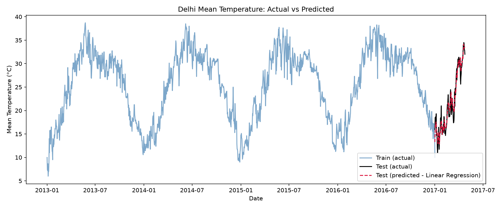
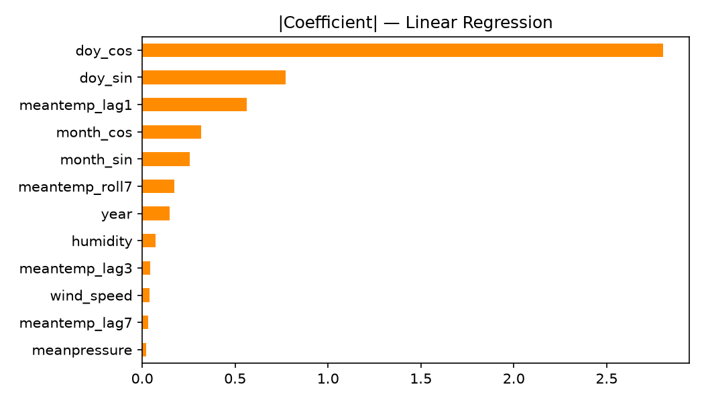

# Delhi Daily Climate — Temperature Prediction

Predicts daily mean temperature in Delhi from calendar-based seasonality and same-day weather readings, trained on 4 years of daily data and validated on a held-out future period.

## Problem

Given historical daily weather records (temperature, humidity, wind speed, pressure), can we predict `meantemp` for a period the model has never seen?

- **Train:** 2013-01-01 → 2017-01-01 (1,462 days)
- **Test:** 2017-01-01 → 2017-04-24 (114 days) — chronologically after train, used only for validation

Data source: [Daily Delhi Climate Data, Kaggle](https://www.kaggle.com/datasets/sumanthvrao/daily-climate-time-series-data)

## Approach

1. **Data cleaning** — `meanpressure` contains invalid readings (raw range: -3 to 7,679 hPa); clipped to a realistic 950–1050 hPa band rather than dropping rows, to keep the daily series continuous.
2. **Feature engineering**
   - Cyclical (sin/cos) encoding of day-of-year and month so Dec 31 and Jan 1 are treated as adjacent, plus year (trend) and same-day humidity/wind/pressure.
   - Lagged `meantemp` (1/3/7 days back) and a 7-day rolling mean, to capture short-term momentum. Train and test are chronologically contiguous, so lags for the first days of test are computed off the tail of train rather than left empty; every lag/rolling feature only looks backward, so no test-period target value leaks in.
3. **Modeling** — compared Linear Regression, Random Forest, and Gradient Boosting regressors.
4. **Validation** — trained only on train data, scored strictly on the unseen test period.

## Results

| Model | MAE (°C) | RMSE (°C) | R² |
|---|---|---|---|
| **Linear Regression** | **1.30** | **1.59** | **0.94** |
| Random Forest | 1.29 | 1.63 | 0.93 |
| Gradient Boosting | 1.39 | 1.75 | 0.92 |

Adding lagged temperature and a rolling average roughly halves the error versus calendar/seasonality features alone (previously MAE 2.11°C, R² 0.84). Most of that gain is short-term persistence — recent actual temperature is a strong predictor of tomorrow's — which a linear model captures just as well as the tree ensembles once it's given as a feature.





## Repo contents

```
├── climate_prediction.ipynb     # Full analysis notebook (run top to bottom)
├── analysis.py                  # Same pipeline as a standalone script
├── DailyDelhiClimateTrain.csv
├── DailyDelhiClimateTest.csv
├── forecast_vs_actual.png
├── predicted_vs_actual_scatter.png
├── feature_importance.png
├── model_comparison.csv
└── requirements.txt
```

## Running it

```bash
pip install -r requirements.txt
python analysis.py
# or open climate_prediction.ipynb
```

## Possible next steps

- Try a dedicated time-series model (SARIMA, Prophet) since forecasting typically won't have same-day humidity/wind/pressure available in advance — this version assumes those are known, which is realistic for nowcasting but not for a true multi-day-ahead forecast
- Evaluate multi-day-ahead accuracy directly (e.g. walk-forward validation), since the current lag features assume yesterday's actual temperature is always available at prediction time
